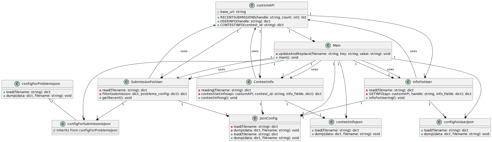

# codeforcesKindOfWrapper
Hard to understand poorly written code purely written for my own usage. Debating with myself to add commands to make it more of a wrapper.
 
## NOW UPLOADED TO PIP
https://pypi.org/project/codeforcesKindOfWrapper/1.0.0/
```pip install codeforcesKindOfWrapper==1.0.0```


## UML Diagram



Current UML diagram.

## Sample Output
```
User Info for benq:
+-------------------------+-----------------------+
| Field                   | Value                 |
+=========================+=======================+
| Handle                  | Benq                  |
+-------------------------+-----------------------+
| Rank                    | legendary grandmaster |
+-------------------------+-----------------------+
| Rating                  | 3593                  |
+-------------------------+-----------------------+
| Maxrank                 | legendary grandmaster |
+-------------------------+-----------------------+
| Maxrating               | 3833                  |
+-------------------------+-----------------------+
| Lastonlinetimeseconds   | 1710683237            |
+-------------------------+-----------------------+
| Registrationtimeseconds | 1435099979            |
+-------------------------+-----------------------+
| Friendofcount           | 15176                 |
+-------------------------+-----------------------+

Recent Submissions for benq:

+-----------+------+--------------------------------+------------------+-----------------------+-----------+
|      Name |   Id | Contestid                      | Problem          | Programminglanguage   |   Verdict |
+===========+======+================================+==================+=======================+===========+
| 251827860 | 1943 | Counting Is Fun (Hard Version) | C++17 (GCC 7-32) | OK                    |        21 |
+-----------+------+--------------------------------+------------------+-----------------------+-----------+
| 251827638 | 1943 | Counting Is Fun (Hard Version) | C++17 (GCC 7-32) | OK                    |        21 |
+-----------+------+--------------------------------+------------------+-----------------------+-----------+
| 251812685 | 1943 | Counting Is Fun (Hard Version) | C++17 (GCC 7-32) | OK                    |        21 |
+-----------+------+--------------------------------+------------------+-----------------------+-----------+

Contest Info for Contest ID 1907:

+---------------------+-------------------------------+
| Field               | Value                         |
+=====================+===============================+
| Name                | Codeforces Round 913 (Div. 3) |
+---------------------+-------------------------------+
| Type                | ICPC                          |
+---------------------+-------------------------------+
| Phase               | FINISHED                      |
+---------------------+-------------------------------+
| Frozen              | False                         |
+---------------------+-------------------------------+
| Durationseconds     | 8100                          |
+---------------------+-------------------------------+
| Starttimeseconds    | 1701787500                    |
+---------------------+-------------------------------+
| Relativetimeseconds | 8903150                       |
+---------------------+-------------------------------+
```


## Configuration Files

The application has several JSON files:

- `submissions/configForSubmissions.json`: Configuration file for submission
- `submissions/configForProblems.json`: Config file to extract purely problem name from submission
- `submissions/configForUser.json`: Configuration file for user
- `submissions/contestInfo.json`: Configuration file for contest

These files allow customization of the information retrieved by the tool.


## Getting Started

1. Download
2. Install the necessary dependencies by running `pip install -r requirements.txt`.
3. Please modify the config files
4. Run
